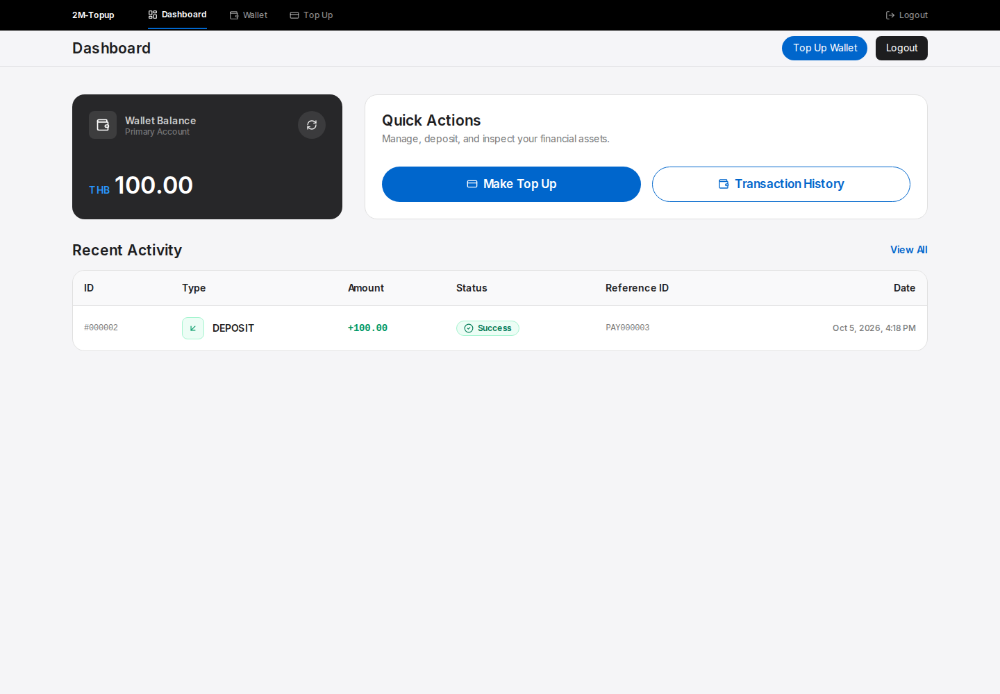
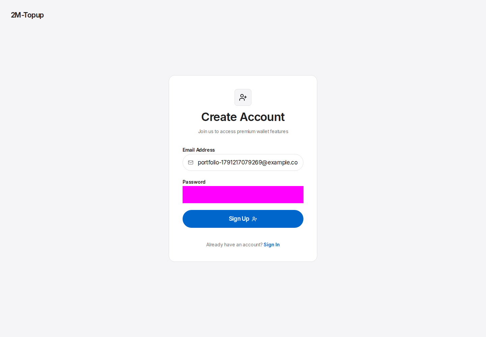
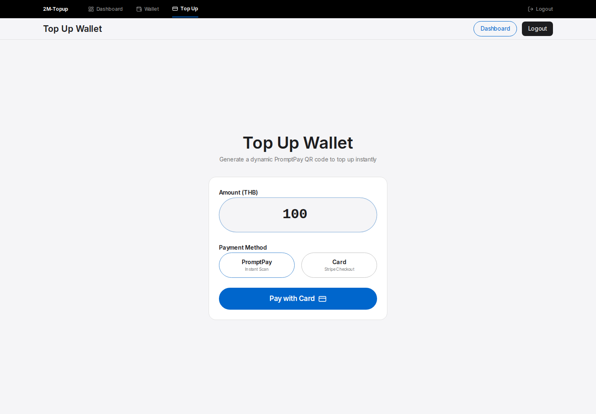
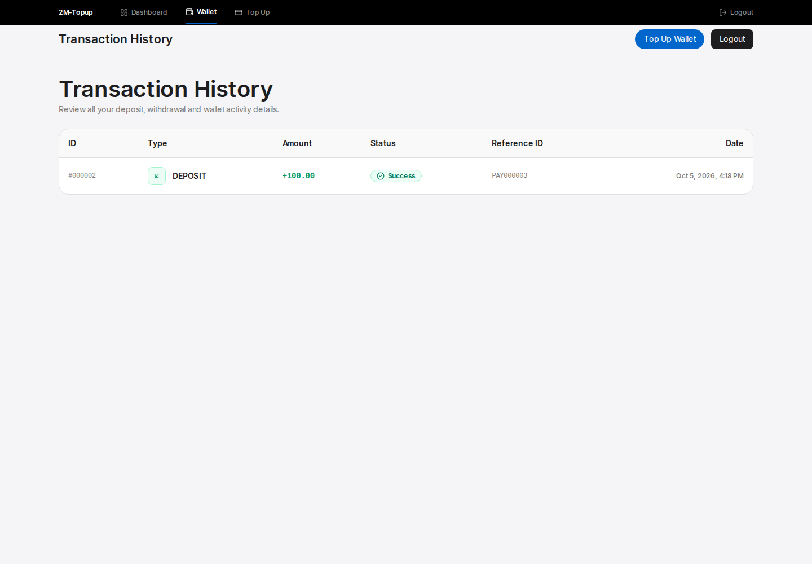
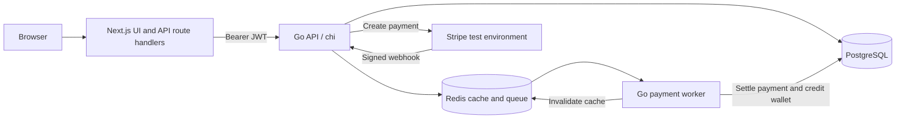

# 2M-Topup

[](https://github.com/koo1F/2M-Topup-Portfolio/actions/workflows/ci.yml)

A fullstack wallet top-up demo built with **Next.js, TypeScript, Go, PostgreSQL, Redis, and Stripe**. Users can register, sign in, create a top-up, and view their wallet balance and transaction history. A separate Go worker processes payment webhooks asynchronously.

This is a learning and portfolio project. Use Stripe test mode or a sandbox for demos. The payment flow and security controls have known limitations listed below; this project is not ready to handle real money.

## Screenshots

Captured from the passing Chromium integration test with PostgreSQL, Redis, and the Go worker. Only the external payment provider is a local signed-event fixture; no real payment is made.



| Register | Create a card top-up |
| --- | --- |
|  |  |



See [the landing page](frontend/public/screenshots/landing.png) and [the portfolio demo guide](docs/portfolio-demo.md) for the recorded flow and narration outline.

## Features

- Email/password registration with bcrypt hashing and automatic wallet creation.
- JWT authentication, with the frontend storing the token in an HTTP-only cookie.
- Wallet balance and transaction history.
- Stripe Checkout for cards and a Stripe PromptPay QR integration.
- Payment creation with an `Idempotency-Key` header, Redis caching, and a database uniqueness constraint.
- Signed webhook verification and a Redis-backed queue.
- A background worker with retries and a dead-letter queue.
- Database transactions and row locking for payment settlement.
- Embedded SQL migrations, Dockerfiles, and Docker Compose setup.
- Go tests for HTTP handlers, services, middleware, repositories, and payment processing; k6 scripts for load testing.

## Architecture



The browser calls Next.js route handlers, which forward requests to the Go API. The API verifies webhook signatures and queues events; the worker updates payment status, inserts a transaction, and credits the wallet in a database transaction. The UI polls for payment status.

## Repository structure

```text
.
├── backend/
│   ├── cmd/server/           # Go API entry point and route wiring
│   └── pkg/
│       ├── user/            # Registration and authentication
│       ├── wallet/          # Balance and transaction history
│       ├── payment/         # Stripe integration and persistence
│       ├── middleware/      # JWT and rate limiting
│       ├── queue/           # Redis queue abstraction
│       ├── cache/           # Redis cache abstraction
│       ├── config/          # Environment configuration
│       ├── database/        # Connections and migration runner
│       └── migrate/sql/     # Embedded up/down SQL migrations
├── frontend/
│   ├── app/                 # Pages and server-side API route handlers
│   ├── components/          # Wallet UI components
│   ├── lib/api.ts           # Backend URL resolution
│   └── proxy.ts             # Page redirects based on auth cookie presence
├── worker/
│   ├── main.go              # Queue listener, concurrency, retries, shutdown
│   └── processor/           # Payment settlement logic and tests
├── k6/                      # Load-test scripts and historical results
├── docker-compose.yml       # Five local services
└── go.work                  # Backend and worker Go workspace
```

Backend features use handler → service → repository layers. The worker reuses backend packages through a local Go module replacement.

## Quick start with Docker

### Requirements

- Git.
- Docker Engine or Docker Desktop running, with Docker Compose.
- Free local ports: `3000`, `8080`, `5432`, and `6379`.
- A Stripe test/sandbox account and Stripe CLI for the complete payment demo.

Go and Node.js do not need to be installed on the host when using Docker.

### 1. Clone and configure

```bash
git clone https://github.com/koo1F/2M-Topup-Portfolio.git
cd 2M-Topup-Portfolio
cp .env.example .env
```

If you already have a local `.env`, preserve your settings before copying the template. For local Compose, the database and Redis addresses are supplied inside `docker-compose.yml`; they point to the `postgres` and `redis` services.

You can leave the Stripe values empty to try registration, login, wallet balance, and transaction history. **Successful payment creation requires a Stripe secret key.** There is no offline payment mode in the normal application. The reproducible E2E test suite uses an isolated local provider fixture instead of a real Stripe account.

### 2. Configure Stripe for payment testing

Install the [Stripe CLI](https://docs.stripe.com/cli), sign in to your test/sandbox environment, and keep this listener running in another terminal:

```bash
stripe login
stripe listen --events checkout.session.completed,checkout.session.expired,payment_intent.succeeded --forward-to http://localhost:8080/api/webhooks/stripe
```

In the root `.env`, set:

```dotenv
STRIPE_SECRET_KEY=sk_test_replace_with_your_own_key
STRIPE_WEBHOOK_SECRET=whsec_replace_with_listener_secret
```

Use the signing secret printed by **this CLI listener**, rather than the secret for a different Dashboard endpoint. Do not commit either value. This frontend does not require a Stripe publishable key for its current redirect/QR flow.

### 3. Start the services

```bash
docker compose up --build -d
docker compose ps
docker compose logs -f backend worker
```

The backend applies embedded SQL migrations automatically on startup. Wait until readiness returns HTTP 200:

```bash
curl -i http://localhost:8080/api/ready
```

Expected body:

```json
{"status":"ready","postgres":true,"redis":true}
```

Open **http://localhost:3000**. `/health` and `/api/health` are liveness checks; `/api/ready` is the startup dependency check. Its flags are not continuous monitoring of dependency health.

### 4. Try the demo

1. Register a new account and sign in.
2. Open the wallet/payment page and create a top-up of at least **10 THB**. For a straightforward demo, choose **card**.
3. Complete Stripe Checkout with a [Stripe test card](https://docs.stripe.com/testing), for example `4242 4242 4242 4242`, a future expiry date, and a test CVC.
4. Keep the CLI listener and worker running. A completed checkout redirects back to the app; the wallet credit is applied by the webhook worker.
5. Check payment status, wallet balance, and transaction history.

The PromptPay path creates a QR through Stripe and depends on the payment methods available in your test account. Do not scan a demo QR with a real banking app. Generic `stripe trigger` fixtures usually lack this application's `payment_id` metadata; create the payment through the app for a linked demo.

### Stop the services

```bash
docker compose down
```

The PostgreSQL volume is retained. To intentionally delete the local demo database:

```bash
docker compose down -v
```

Redis currently has no persistent volume in Compose, so queued jobs and cache can be lost when its container is replaced.

## Local development without app containers

Use **Go 1.26+**, **Node.js 22 LTS**, npm, and Docker for PostgreSQL and Redis. Commands below use a POSIX shell, such as bash or zsh. Native Windows users can use WSL or the Docker setup.

Start infrastructure from the repository root:

```bash
docker compose up -d postgres redis
```

In terminal 1, start the API:

```bash
cd backend
cp .env.example .env
# Edit .env and add your own Stripe test values if testing payments.
set -a
. ./.env
set +a
go run ./cmd/server
```

In terminal 2, wait for `/api/ready`, then start the worker:

```bash
cd worker
cp .env.example .env
set -a
. ./.env
set +a
go run .
```

In terminal 3, start the frontend:

```bash
cd frontend
cp .env.example .env.local
npm ci
npm run dev
```

For payment testing, keep the Stripe listener from the Docker instructions running too. **The Go processes do not automatically load `.env` files.** The shell export commands above are required; Next.js loads `.env.local` automatically.

## Configuration reference

| Variable | Used by | Purpose |
| --- | --- | --- |
| `DATABASE_URL` | API, worker | PostgreSQL connection; Compose supplies the container address |
| `REDIS_URL` | API, worker | `host:port`, `redis://`, or `rediss://` connection |
| `PORT` | API | HTTP port; defaults to `8080` |
| `JWT_SECRET` | API | Signs and verifies authentication tokens |
| `WEBHOOK_SECRET` | API | Legacy signing-secret fallback; normal builds reject mock HMAC webhooks |
| `PAYMENT_RATE_LIMIT` | API | Payment-create requests per user per minute; defaults to `200` |
| `STRIPE_SECRET_KEY` | API | Stripe test/sandbox API key |
| `STRIPE_WEBHOOK_SECRET` | API | Secret for the active webhook listener/endpoint |
| `STRIPE_SUCCESS_URL` | API | Checkout return URL; defaults to `/payment/success` on localhost:3000 |
| `STRIPE_CANCEL_URL` | API | Checkout cancellation URL; defaults to `/payment/cancel` on localhost:3000 |
| `API_URL` | Next.js server | Go API URL; defaults to `http://localhost:8080` |
| `INTERNAL_API_URL` | Next.js server | Optional backend URL that takes priority over `API_URL` |

After changing the root Compose `.env`, recreate the API container to pick up new settings:

```bash
docker compose up -d --force-recreate backend
```

## API overview

These routes belong to the **Go API on port 8080**. Protected routes require `Authorization: Bearer <JWT>`.

| Method | Route | Authentication | Purpose |
| --- | --- | --- | --- |
| POST | `/api/auth/register` | Public | Create user and wallet |
| POST | `/api/auth/login` | Public | Return JWT |
| GET | `/api/wallet` | JWT | Get current user's balance |
| GET | `/api/wallet/transactions` | JWT | List current user's transactions |
| POST | `/api/payment/create` | JWT + `Idempotency-Key` | Create payment; body: `{"amount":100,"method":"card"}` |
| GET | `/api/payment/{id}/status` | JWT | Get payment status; see ownership limitation below |
| POST | `/api/webhooks/stripe` | Webhook signature | Verify and queue event |
| GET | `/api/ready` | Public | Startup readiness |

Use a fresh idempotency key for each new top-up, and reuse the same key when retrying the same request. Keys are scoped to the authenticated user. Reusing a key with a different amount or method returns HTTP 409. Payment status reads return HTTP 404 for a non-owner, including when the response is cached. A payment response can have `status: "FAILED"` even with HTTP 201; inspect the response body as well as the HTTP status.

## Development checks

Run the Go checks from each module, rather than `go test ./...` at the workspace root:

```bash
(cd backend && go test ./...)
(cd worker && go test ./...)
```

Frontend checks:

```bash
cd frontend
npm run lint
npx tsc --noEmit
npm run build
PORT=3000 HOSTNAME=127.0.0.1 npm start
```

The frontend build needs access to Google Fonts for Inter. The build script copies static assets into the standalone output; `npm start` runs that output, with port 3000 as the default. Docker uses Node.js 22 and Go 1.26, and builds Go binaries for the container architecture.

The [k6 directory](k6/README.md) contains historical load-test results. The scripts currently target a hard-coded hosted backend and invoke Stripe-backed payment creation. Review and change the target before running them against your own test environment. These results are not a production capacity guarantee.

## Reproducible integration and browser tests

The E2E suite exercises the normal Go API, SQL repositories, Redis queue, and production worker. A separate provider fixture intercepts the Stripe SDK and emits correctly signed test events. It is **absent from normal builds** and does not make real payments.

Start isolated test infrastructure (ports 55432 and 56379):

```bash
docker compose -p 2m-topup-test -f docker-compose.test.yml up -d --wait
cd frontend
npm ci
npx playwright install chromium
npm run test:e2e
```

Playwright starts the API with `-tags=e2e`, builds/starts the frontend on port 13000, and starts a compiled production worker. It checks registration/login, the HTTP-only cookie, wallet settlement, duplicate events, ownership, and scoped idempotency. It records a video, captures five portfolio screenshots in `frontend/public/screenshots/`, and writes a report under `frontend/playwright-report/`.

For a machine that cannot launch a browser, run the HTTP integration test separately:

```bash
npx playwright test api-flow.spec.ts --project=chromium
```

The HTTP test does not launch Chromium and still tests Next.js proxy → Go API → SQL → Redis → worker. It does not verify hydration, browser cookie handling, or visual layout.

From the repository root, stop the disposable test infrastructure:

```bash
docker compose -p 2m-topup-test -f docker-compose.test.yml down
```

The [CI workflow](.github/workflows/ci.yml) uses PostgreSQL 16 and Redis 7 and uploads browser evidence as an Actions artifact. See [the demo guide](docs/portfolio-demo.md) for a recording outline and how to retrieve the gallery.

## Troubleshooting

| Symptom | Check |
| --- | --- |
| Docker cannot connect | Start Docker Desktop/Engine before running Compose |
| Port already allocated | Stop the conflicting local service or change the published host port |
| API returns 503 | Check `/api/ready` and backend logs for DB/Redis connection or migration errors |
| Auth works but payment fails | Set a valid Stripe test key and inspect the returned payment status and API logs |
| Payment succeeds but balance stays unchanged | Verify CLI forwarding, signing secret, payment metadata, and worker logs |
| Webhook returns 401 | Match `STRIPE_WEBHOOK_SECRET` to the active CLI listener, then recreate backend |
| Frontend proxy cannot reach API | Use `http://backend:8080` inside Compose and `http://localhost:8080` for local Node |

## Known limitations and next steps

- Normal application builds reject mock HMAC webhooks. The provider fixture is compiled only with the explicit `e2e` build tag and requires a local test database. Local default secrets must be replaced in any hosted environment.
- Settlement should additionally validate provider amount, currency, payment status, and gateway reference before crediting a wallet.
- Redis list consumption removes a job before processing; a worker crash can lose an in-flight job. Durable acknowledgement/recovery and bounded worker concurrency are future improvements.
- Money passes through Go `float64`; integer satang or a decimal type would make rounding explicit.
- The production npm dependency audit is clean at the time of verification. The full audit still reports five high-severity findings in the lint-tool dependency chain (`braces` → `micromatch` → `fast-glob` → Next ESLint); no compatible patched `braces` version was available. Recheck advisories before hosting.
- CI runs Go tests with the race detector, vet/build checks, frontend lint/typecheck/build, production dependency audit, and browser/HTTP integration tests. Historical k6 results still need reproducible raw reports.

This public portfolio repository starts with fresh Git history and excludes real `.env` files and generated binaries. Configure local settings from `.env.example` and keep hosted secrets in your deployment environment.
